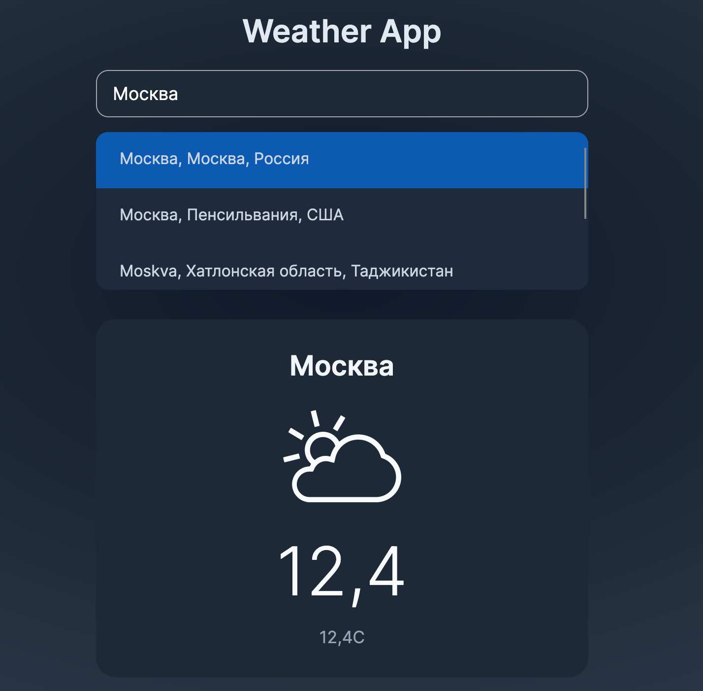

# Weather App

## Описание

Это учебное приложение для просмотра погоды, реализованное с использованием архитектуры MVVM (Model-View-ViewModel) на платформе Avalonia UI. Проект создан с целью изучения и понимания принципов построения современных десктопных приложений.

## Архитектура

Приложение построено по паттерну MVVM, который обеспечивает чёткое разделение ответственности между компонентами:

- **Model** — содержит данные и логику работы с API (погода, геокодирование)
- **View** — отвечает за визуальное представление (XAML-файлы)
- **ViewModel** — промежуточный слой, связывающий View и Model, реализующий команды и предоставляет данные для отображения

## Функциональность

- Поиск города по названию с использованием геокодирования
- Отображение текущей погоды в выбранном городе
- Использование SVG-иконок погоды через `PathIcon` и `IconPath`
- Адаптивный и стилизованный интерфейс с красивым радиальным фоном

## Технологии и API

- **Avalonia UI** — кроссплатформенный фреймворк для создания десктопных приложений
- **Open-Meteo Weather API** — для получения данных о погоде
- **Геокодирование** — для преобразования названия города в координаты
- **C# и XAML** — основные языки разработки
- **Data Binding и Commands** — для реактивного обновления интерфейса

## Особенности реализации

- Иконки погоды отображаются с помощью `PathIcon`, где `Data` привязан к `WeatherIconPath` из ViewModel
- Поддержка ввода города с клавиатуры (Enter для поиска)
- Стилизованные элементы интерфейса: скруглённые углы, тени, градиентный фон

## Цель проекта

Этот проект является учебным и предназначен для:

- Понимания архитектуры MVVM
- Работы с асинхронными запросами к API
- Освоения привязки данных и команд в Avalonia
- Практики использования векторной графики (SVG через PathIcon)

## Установка и запуск

1. Клонируйте репозиторий
2. Откройте решение в Visual Studio или Rider
3. Восстановите пакеты NuGet
4. Запустите проект `Weather-App`

---

© 2026 Учебный проект по изучению MVVM и Avalonia UI